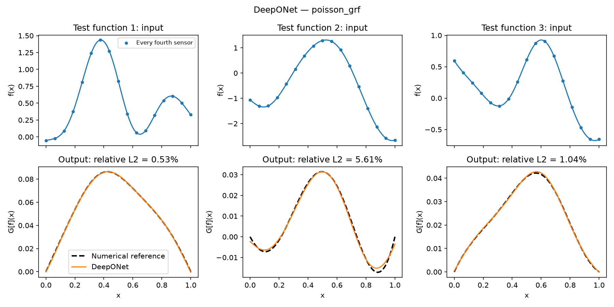
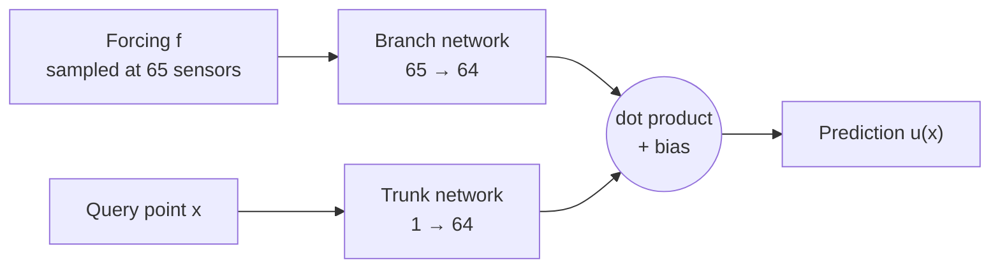
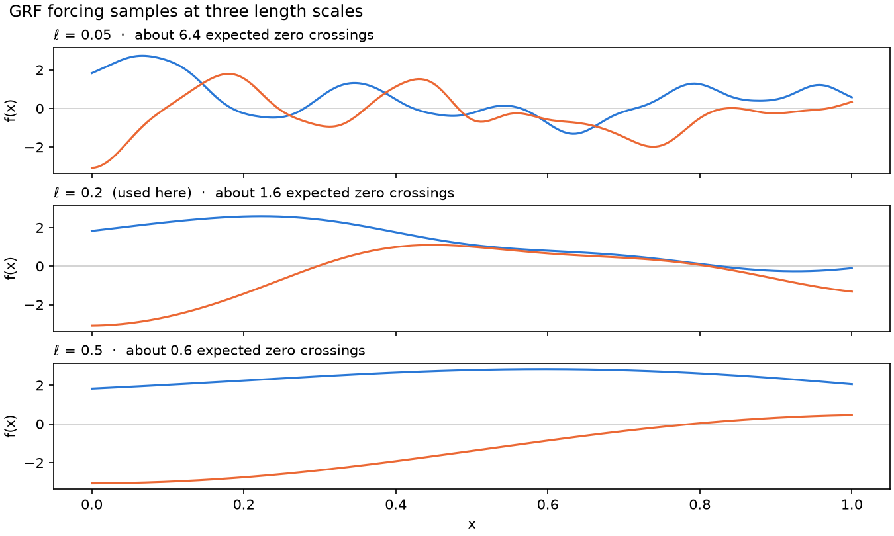

# DeepONet for the 1D Poisson equation

A neural operator that learns to solve $-u''(x) = f(x)$ on $[0, 1]$ with
$u(0) = u(1) = 0$. It takes a forcing function $f$, sampled at 65 points, and
returns the solution $u$ at any $x$, without calling a solver. Forcing functions
are random draws from a Gaussian random field.



*The first three of 512 unseen test functions, not selected for low error. Top:
input forcing. Bottom: DeepONet prediction (orange) vs. finite-difference reference
(dashed).*

## Results

| | |
|---|---|
| Test error, 512 unseen functions (relative L2) | **1.14%** |
| Median per-function error | 1.19% |
| 95th-percentile per-function error | 5.15% |
| Input-independent baseline (mean training solution) | 100.06% |
| Trainable parameters | 20,993 |
| Training time | 7.4 s (20,000 steps, Apple M4 CPU, one thread) |

## Context

This project was proposed at the
[2nd Atlanta Mathematics of Data Science Bootcamp](https://wliao60.math.gatech.edu/bootcamp2026/)
(Georgia Tech, September 2026). The focus was getting familiar with the DeepONet
architecture: how the branch and trunk networks split the work, how training data
for an operator is built, and how to evaluate it honestly. The implementation was
written with help from Claude.

## How it works



The branch network turns the whole input function into 64 coefficients; the trunk
network turns a location into 64 basis-function values. Their dot product (scaled
by 1/√64, plus a learned bias) is the prediction, so one forward pass of the branch
gives $u$ at any number of points.

- **Data.** Forcing functions are drawn from a zero-mean Gaussian random field with
  a squared-exponential kernel (length scale 0.2) on a 257-point grid. Targets come
  from a second-order finite-difference solver. 2,048 training, 256 validation, and
  512 test functions, each split with its own seed. The length scale controls how
  wiggly the inputs are:

  

- **Model.** Branch and trunk are both two-hidden-layer tanh MLPs of width 64,
  20,993 parameters in total.
- **Training.** Adam with a cosine learning-rate schedule. Each step uses 64
  functions and 64 fresh query points, including both endpoints. The checkpoint with
  the lowest validation error is kept, and the test split is generated only after
  that choice is made.
- **Checks.** The solver is verified against an exact solution and for second-order
  convergence before any training, both in the notebook and in `tests/`.

## Speed

On the machine above, DeepONet inference is about **2x faster** than the
finite-difference solver used to generate the data, at every batch size tested.
A solver that factors its matrix once and reuses it is still faster than the network
here (0.41x at batch 256). For a 1D linear problem this small, classical solvers are
very cheap; the speed case for neural operators lies in larger or nonlinear problems.
Timings vary by machine; the notebook re-measures them on each run.

## Repository layout

```
├── deeponet_poisson_grf.ipynb   # Driver: settings, checks, training, evaluation, plots
├── grf.py                       # Gaussian random field sampling, sensor grid
├── poisson.py                   # Finite-difference reference solver
├── model.py                     # DeepONet, target interpolation, training loop
├── benchmark.py                 # Network vs. solver timing
├── tests/                       # pytest unit tests for the solver, sampler, and model
└── figures/                     # Figures used in this README
```

## Running it

```bash
pip install -r requirements.txt
jupyter notebook deeponet_poisson_grf.ipynb   # run all cells; training is ~7 s on an M4 CPU
pytest                                        # 12 tests, about a second
```

The notebook writes the trained model, dataset, metrics, and plots to
`artifacts/deeponet_poisson_grf/`. All seeds are fixed, so reruns on the same
machine reproduce the results above.

## Limitations

- Errors are measured against a finite-difference reference, not the exact
  continuous solution.
- The test set comes from the same random field as training (length scale 0.2).
  Accuracy on other kinds of forcing, including rougher fields like ℓ = 0.05 in the
  figure above, is not established.
- Boundary values are learned from examples rather than built into the network.
  The largest predicted boundary value on the test set is 4.5 × 10⁻³.

## Reference

Lu, L., Jin, P., Pang, G., Zhang, Z., & Karniadakis, G. E. (2021). Learning nonlinear
operators via DeepONet based on the universal approximation theorem of operators.
*Nature Machine Intelligence*, 3, 218–229.
